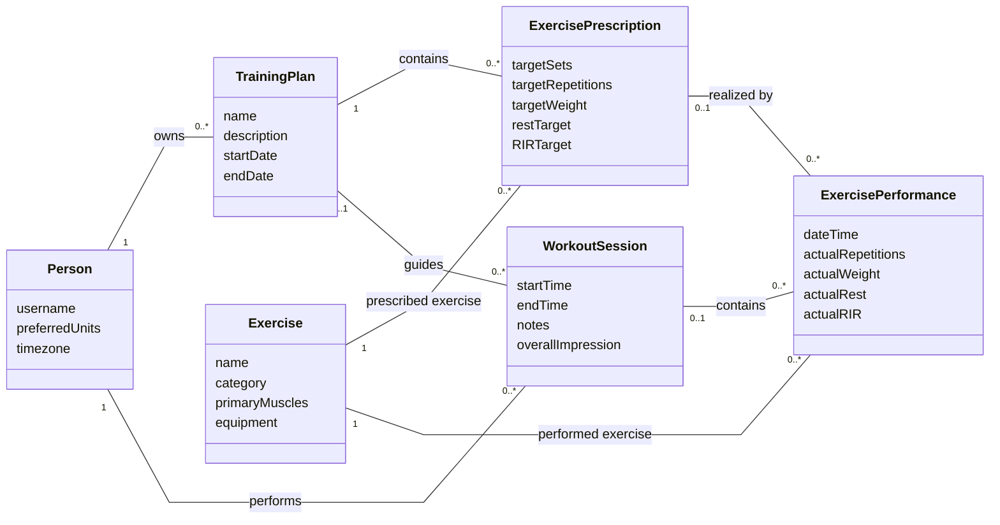

# Domain Model

```mermaid
%%{init: {"flowchart": {"curve": "linear"}}}%%

classDiagram
    direction LR

    class Person {
        username
        preferredUnits
        timezone
    }

    class TrainingPlan {
        name
        description
        startDate
        endDate
    }

    class ExercisePrescription {
        targetSets
        targetRepetitions
        targetWeight
        restTarget
        RIRTarget
    }

    class Exercise {
        name
        category
        primaryMuscles
        equipment
    }

    class WorkoutSession {
        startTime
        endTime
        notes
        overallImpression
    }

    class ExercisePerformance {
        dateTime
        actualRepetitions
        actualWeight
        actualRest
        actualRIR
    }

    Person "1" -- "0..*" TrainingPlan : owns
    Person "1" -- "0..*" WorkoutSession : performs

    TrainingPlan "1" -- "0..*" ExercisePrescription : contains
    TrainingPlan "0..1" -- "0..*" WorkoutSession : guides

    Exercise "1" -- "0..*" ExercisePrescription : prescribed exercise
    Exercise "1" -- "0..*" ExercisePerformance : performed exercise

    WorkoutSession "0..1" -- "0..*" ExercisePerformance : contains
    ExercisePrescription "0..1" -- "0..*" ExercisePerformance : realized by
```