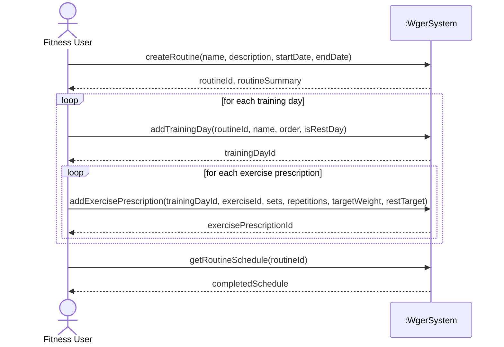
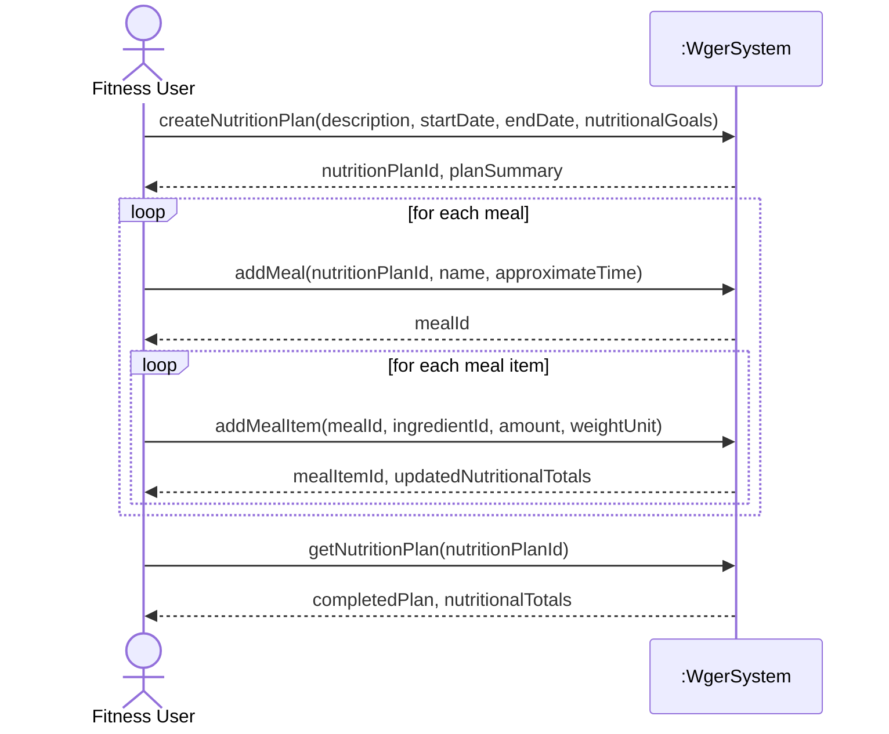
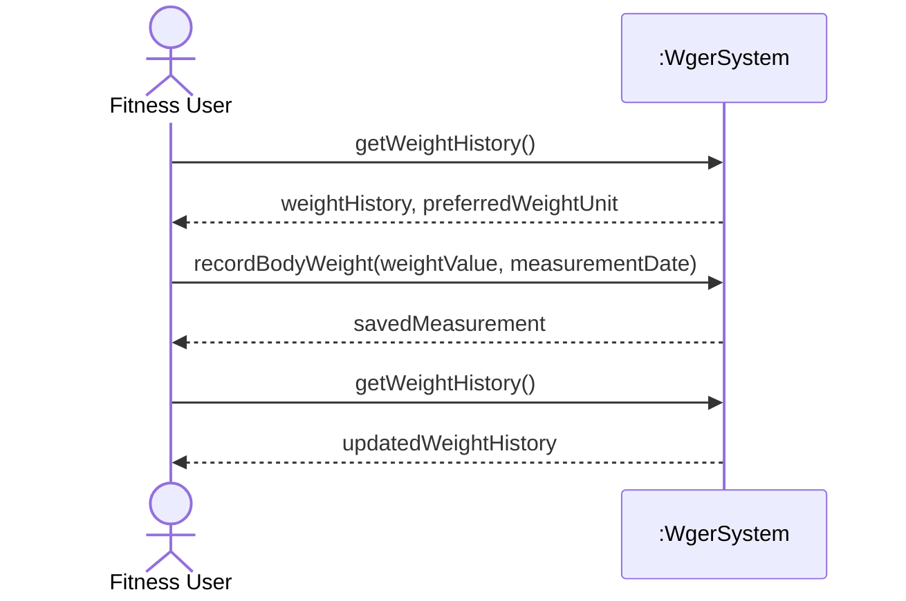

# System Sequence Diagrams

## Create Workout Routine

```mermaid
sequenceDiagram
    actor User as Fitness User
    participant System as :WgerSystem

    User->>System: createRoutine(name, description, startDate, endDate)
    System-->>User: routineId, routineSummary

    loop for each training day
        User->>System: addTrainingDay(routineId, name, order, isRestDay)
        System-->>User: trainingDayId

        loop for each exercise prescription
            User->>System: addExercisePrescription(trainingDayId, exerciseId, sets, repetitions, targetWeight, restTarget)
            System-->>User: exercisePrescriptionId
        end
    end

    User->>System: getRoutineSchedule(routineId)
    System-->>User: completedSchedule
```

## Create Nutrition Plan

```mermaid
sequenceDiagram
    actor User as Fitness User
    participant System as :WgerSystem

    User->>System: createNutritionPlan(description, startDate, endDate, nutritionalGoals)
    System-->>User: nutritionPlanId, planSummary

    loop for each meal
        User->>System: addMeal(nutritionPlanId, name, approximateTime)
        System-->>User: mealId

        loop for each meal item
            User->>System: addMealItem(mealId, ingredientId, amount, weightUnit)
            System-->>User: mealItemId, updatedNutritionalTotals
        end
    end

    User->>System: getNutritionPlan(nutritionPlanId)
    System-->>User: completedPlan, nutritionalTotals
```

## Track Body Weight

```mermaid
sequenceDiagram
    actor User as Fitness User
    participant System as :WgerSystem

    User->>System: getWeightHistory()
    System-->>User: weightHistory, preferredWeightUnit
    User->>System: recordBodyWeight(weightValue, measurementDate)
    System-->>User: savedMeasurement
    User->>System: getWeightHistory()
    System-->>User: updatedWeightHistory
```
